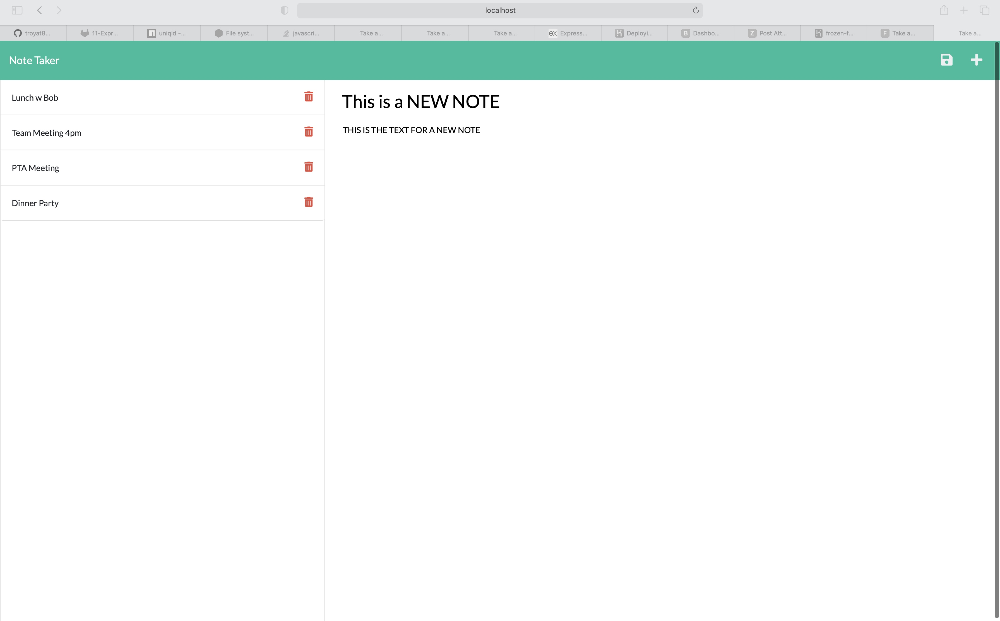

# Express.js: Note-Taker

## About Note-Taker

A note taking application that can be used to write and save notes. This app uses Express.js back end and will save and retrieve note data from a JSON file.


## User Story

```
AS A small business owner
I WANT to be able to write and save notes
SO THAT I can organize my thoughts and keep track of tasks I need to complete
```


## Final Product


